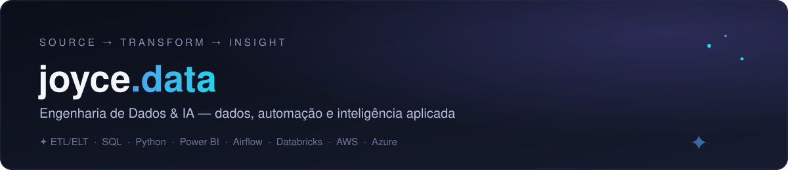

---

### ✦ Sobre

Especialista em dados com raízes em QA — o que significa que, para mim, uma solução só está pronta quando é testada, validada e documentada.

Minha jornada começou em 2005, no suporte técnico, onde aprendi a ouvir o usuário e resolver problemas na raiz. A passagem por QA moldou minha visão analítica e crítica, e desde 2020 aplico essa bagagem como Especialista em Dados, atuando em ETL/ELT, SQL, Python e Power BI. Também tenho experiência com SSIS, .NET Framework e Azure, e venho me dedicando ao estudo de Big Data com Databricks e de IA aplicada a PLD/AML (Prevenção à Lavagem de Dinheiro).

Gosto de documentar minha trilha de aprendizado publicamente — este perfil reflete isso: cada repositório é uma etapa do caminho, não só um resultado final.

**→ Veja o portfólio completo, com cases de solução: [joycequoos.github.io](https://joycequoos.github.io/)**

---

### ✦ Stack por domínio

<table width="100%">
<tr>
<td align="center" valign="top" width="33%">

**Engenharia de Dados**

 
 

</td>
<td align="center" valign="top" width="33%">

**IA & Automação**

 
 

</td>
<td align="center" valign="top" width="33%">

**BI & Análise**

 
 

</td>
</tr>
</table>
<table align="center">
<tr>
<td align="center">

</td>
<td align="center">

</td>
<td align="center">

</td>
<td align="center">

</td>
</tr>
</table>

---

### ✦ Problemas reais, soluções entregues

Três recortes do case de PLD (Prevenção à Lavagem de Dinheiro) — do pipeline de ingestão à priorização dos alertas.
**→ [Ver o storytelling completo](https://joycequoos.github.io/storytelling_pld_1.html)**

 

<table width="100%">
<tr>
<td width="100%">

**Pipeline D-1 de ingestão para PLD**

> **Problema:** dados de clientes e operações chegam diariamente em arquivo bruto e precisam estar limpos e disponíveis antes das regras de Compliance rodarem.
> **Solução:** pacote SSIS com 4 etapas — limpeza da staging, leitura/validação do arquivo D-1, execução de procedure de consolidação e liberação das tabelas para análise.

 

</td>
</tr>
<tr>
<td width="100%">

**Motor de regras de detecção de transações suspeitas**

> **Problema:** verificar manualmente cada movimentação contra o limiar de Compliance não escala com o volume diário de operações.
> **Solução:** regra automatizada que sinaliza transações acima do parâmetro definido e segrega os resultados em tabela própria, criando fila de trabalho para o time de Compliance.

 

</td>
</tr>
<tr>
<td width="100%">

**Priorização de alertas com SQL + Python**

> **Problema:** com dezenas de alertas gerados por dia, o Compliance precisa saber por onde começar a investigação.
> **Solução:** conexão Python↔SQL Server (pymssql) para consultar alertas, ranquear os clientes com maior incidência e cruzar volume de movimentação com risco por produto.

 

</td>
</tr>
</table>

---

### ✦ Áreas de estudo & projetos

| Área | Descrição |
|---|---|
| [Dados](https://github.com/joycequoos/Principal_Data/blob/main/README.md) | Trilha de Análise de Dados, Engenharia de Dados e Ciência de Dados / IA. |
| [Desenvolvimento](https://github.com/joycequoos/Development) | Python, Node.js, .NET, Full Stack e boas práticas de versionamento. |
| [Sites & Desenvolvimento Web](https://github.com/joycequoos/Sites/blob/main/README.md) | HTML, CSS, JavaScript e Bootstrap. |
| [Testes de Software / QA](https://github.com/joycequoos/Test_QA) | Estudos e práticas de automação de testes. |

---

### Vamos conversar?

Colaborações e novas conexões em Engenharia de Dados e IA.

 
 

 

✦ *joyce.data — pipelines e IA para problemas reais*

